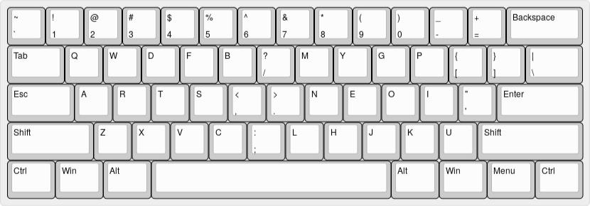

`CODE` keyboard layout --- for all computer users
=================================================



## Pro

- Uses a `Colemak`-like character layout, which is pretty popular.
- Good for `Vim` users, `LHJK` are put together in a row.
- Friendly to emacs users, `C-x`, `M-x` and `C-c` are easy to touch.
- For game players, `WASD` are still together.
- Very few lateral alphabetic motion to break typists' threads of thinking.
- Only a couple of keys move between hands for typists come from `QWERTY`.
- Be more ergonomic than `QWERTY` and many other layouts:
```
mod-dh      2.012
Colemak     2.310
Dvorak      2.435
workman     1.876
MTGAP       1.810
BEAKL       2.018
asset       2.438
Norman      1.888
minimak-8   2.634
qwerty      3.947
code (mygp) 1.781
Halmak      1.622
```
, according to [MadRabbit's measurement]( http://nikolay.rocks/2016-10-22-keyboard-analytics) and [mod-dh's analyzer](http://colemakmods.github.io/mod-dh/analyze.html).

- Common key bindings still can be done on the left hand.
- Be friendly to both matrix keyboard and standard keyboard.
- In addition to optimizing English, Chinese Pinyin is also taken into account.
- Positions of the most popular punctuation marks are optimized.
- It is `free and open source software` (`FOSS`).

------

## Windows: AutoHotKey

The fastest way to try out `CODE` on Windows is to use the [AutoHotKey](https://autohotkey.com/) scripts.
See the [**autohotkey folder**](autohotkey/).

## Linux: Xmodmap / console files

- The file for [xmodmap](http://www.x.org/archive/X11R6.8.2/doc/xmodmap.1.html) is available in the [**xmodmap folder**](xmodmap/).
- Keymap file for the console is provided in the [**console folder**](console/).
- You may need to customize these for your own language/region.

## macOS: Karabiner
The fastest way to try out `CODE` on macOS is to use the [Karabiner](https://pqrs.org/osx/karabiner/) scripts.
See the [**Karabiner folder**](karabiner/).

------

## About
- `CODE` keyboard layout is forked from [`Colemak-DH`](http://colemakmods.github.io/mod-dh/).
- For the name `CODE`, `CO` is taken from `COlemak`, `D` is taken from `mod-Dh`, and `E` implies an extension.
